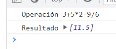
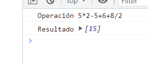
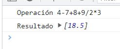

# Documentacion

1. El programa acepta un string donde se escribirán la operación
2. Mientras el string sea mayor a 20 caracteres seguirá pidiendo un nuevo string 
3. Convertir el string a un array de caracteres **arrayString**
4. Inicializar una variable contadora **numeroSigno** que guarde cuantas veces hay signos de operación en el string
5. Recorrer el array **arrayString** para determinar cuantos signos (+,-,*,/) hay en él
    1. Inicializar variables booleanas **existenMult** y **existenMult** a true que me diga si existen signos de multiplicacion o division 
6. Crear un ciclo for para la cantidad de veces que se realizarán las operaciones según la cantidad  encontradas con la variable **numeroSigno**
    1.  Atravesar el array **arrayString** con cada elemento
        1. Verificar si cada elemento es un signo de operacion (*,/,+,-)
            1. Verificar si: el elemento es (*) o (/) y si **existeMult** o **existeDiv** son verdaderos
                1. Si son verdaderos
                    1. Verificar si el signo es multiplicacion
                        1. Llamar a  la funcion de **realizarOperacion** según sea el tipo de operación
                        2. Llamar a la función **quitarDigitos** para eliminar los digitos originales y reemplazarlos por la operación real. 
                    2. Verificar si es division
                        1. Llamar a  la funcion de **realizarOperacion** según sea el tipo de operación
                        2. Llamar a la función **quitarDigitos** para eliminar los digitos originales y reemplazarlos por la operación real. 
            2. Verificar si: el elemento es (+) o (-) son verdaderos
                1. Si son verdaderos
                    1. Verificar si el signo es suma
                        1. Llamar a  la funcion de **realizarOperacion** según sea el tipo de operación
                        2. Llamar a la función **quitarDigitos** para eliminar los digitos originales y reemplazarlos por la operación real. 
                    2. Verificar si es signo es resta
                        1. Llamar a  la funcion de **realizarOperacion** según sea el tipo de operación
                        2. Llamar a la función **quitarDigitos** para eliminar los digitos originales y reemplazarlos por la operación real.

#Ejemplos

